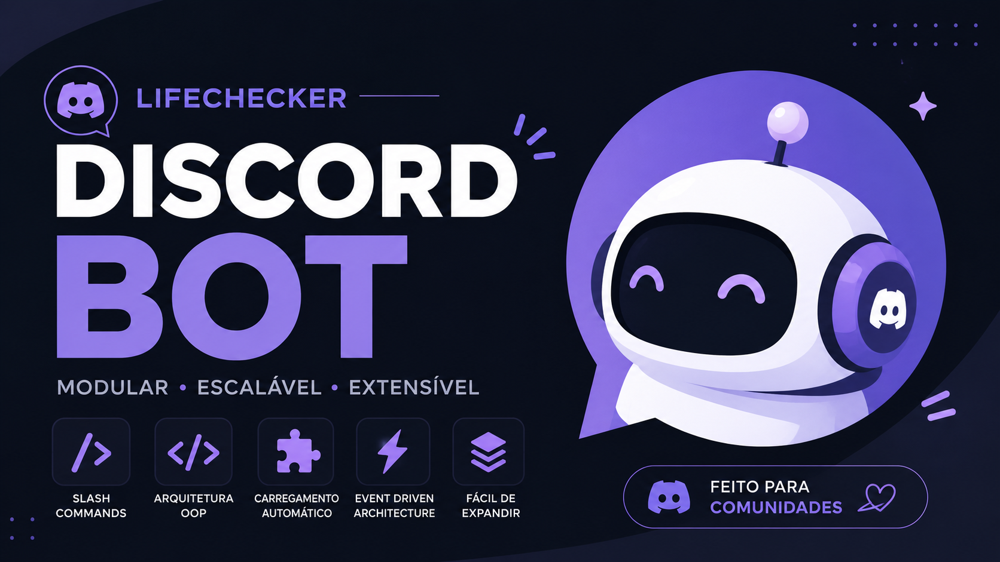

# 🤖 LifeChecker Discord Bot




Bot para Discord desenvolvido em **TypeScript** utilizando **Discord.js v14**, construído com foco em **arquitetura orientada a objetos**, **carregamento dinâmico de módulos** e **alta extensibilidade**.

O projeto funciona como um pequeno framework para bots Discord, permitindo a criação de comandos, eventos, botões, modais e menus de seleção de forma organizada e escalável.

---

# ✨ Funcionalidades

- Slash Commands
- Carregamento automático de comandos
- Carregamento automático de eventos
- Suporte a Buttons
- Suporte a Select Menus
- Suporte a Modals
- Arquitetura baseada em OOP
- Cliente customizado (Extended Client)
- Registro automático de comandos na API do Discord
- Sistema de logging centralizado
- Configuração através de variáveis de ambiente
- Estrutura modular para crescimento do projeto

---

# 🏗️ Arquitetura

O projeto utiliza uma arquitetura baseada em eventos do Discord combinada com orientação a objetos.

Ao iniciar:

1. O bot carrega as configurações.
2. Instancia o `ExtendedClient`.
3. Procura automaticamente por comandos.
4. Procura automaticamente por eventos.
5. Registra Slash Commands.
6. Inicia a conexão com o Discord.

Fluxo simplificado:

```text
Discord
   │
   ▼
ExtendedClient
   │
   ├── Commands
   ├── Events
   ├── Buttons
   ├── Selects
   └── Modals
```

---

# 📁 Estrutura do Projeto

```text
src
│
├── commands/
│   └── Slash Commands
│
├── events/
│   └── Eventos do Discord
│
├── library/
│   ├── Command.ts
│   ├── Event.ts
│   └── Logging.ts
│
├── structs/
│   └── ExtendedClient.ts
│
├── config/
│   └── Environment Variables
│
└── index.ts
```

---

# 🧩 Extended Client

O projeto estende a classe nativa do Discord.js:

```ts
class ExtendedClient extends Client
```

Adicionando coleções para:

```ts
commands
buttons
selects
modals
```

Isso permite centralizar toda a lógica da aplicação em um único cliente.

---

# ⚡ Sistema de Comandos

Os comandos são carregados dinamicamente.

Exemplo:

```ts
export default new Command({
  data: new SlashCommandBuilder()
    .setName("ping")
    .setDescription("Retorna pong"),
    
  run: async ({ interaction }) => {
    await interaction.reply("Pong!");
  }
});
```

Após adicionar um arquivo na pasta:

```text
commands/
```

o sistema o registra automaticamente.

---

# 🎯 Sistema de Eventos

Eventos também são descobertos automaticamente.

Exemplo:

```ts
export default new Event({
  event: "ready",

  run: async (client) => {
    console.log("Bot online");
  }
});
```

---

# 🔘 Componentes de Interface

O bot suporta:

## Buttons

```ts
ButtonBuilder
```

## Select Menus

```ts
StringSelectMenuBuilder
```

## Modals

```ts
ModalBuilder
```

Todos podem ser registrados através do sistema de coleções do cliente.

---

# ⚙️ Variáveis de Ambiente

Crie um arquivo:

```bash
.env
```

Exemplo:

```env
TOKEN=SEU_TOKEN
CLIENT_ID=SEU_CLIENT_ID
GUILD_ID=SEU_GUILD_ID
```

---

# 🚀 Instalação

Clone o projeto:

```bash
git clone https://github.com/seu-usuario/lifechecker-bot.git
```

Entre na pasta:

```bash
cd lifechecker-bot
```

Instale as dependências:

```bash
npm install
```

Configure o arquivo `.env`.

Inicie o bot:

```bash
npm run dev
```

ou

```bash
npm start
```

---

# 📦 Principais Dependências

## Discord.js

Biblioteca principal utilizada para integração com a API do Discord.

Documentação:

https://discord.js.org

---

## TypeScript

Adiciona tipagem estática ao Node.js.

Documentação:

https://www.typescriptlang.org

---

## dotenv

Responsável pelo carregamento das variáveis de ambiente.

Documentação:

https://www.npmjs.com/package/dotenv

---

## env-var

Validação e leitura segura das variáveis de ambiente.

Documentação:

https://www.npmjs.com/package/env-var

---

# 🧠 Conceitos Aplicados

Durante o desenvolvimento foram utilizados conceitos como:

- Programação Orientada a Objetos (OOP)
- Herança
- Composição
- Event Driven Architecture
- Dynamic Module Loading
- Dependency Organization
- Collections Pattern
- Type Safety com TypeScript

---

# 👨‍💻 Autor

Desenvolvido por **Davi Batista**.

GitHub:

https://github.com/odavibatista